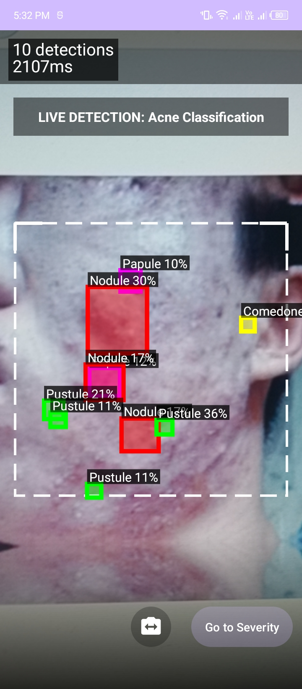
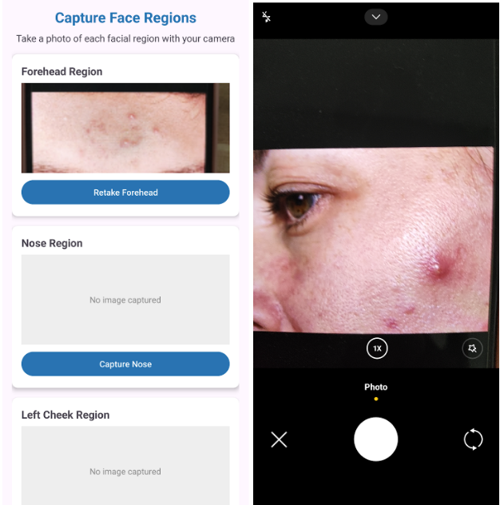

# 🤖 AcneVision – Android-Based Acne Severity Detection and Classification

**AcneVision** is an Android application that detects and classifies acne severity using advanced computer vision. 
It integrates medical grading standards to provide users with real-time, medically aligned acne analysis from camera input.

---

## 🧠 Core Features

- 📷 **Camera-Based Detection** – Capture facial images and identify acne using real-time object detection.
- 🔍 **YOLOv9 Model Integration** – Utilizes YOLOv9 for accurate acne spot detection.
- 🧪 **GAGS Severity Scoring** – Implements the Global Acne Grading System (GAGS) to provide medically backed feedback.
- 🔲 **Bounding Box Visualization** – Clearly highlights acne regions on the captured image.
- 🔄 **ONNX Runtime** – Uses an optimized ONNX model for seamless mobile performance.
- 📱 **Modern Android UI** – Developed using Kotlin and Jetpack libraries.

---

## 🛠️ Tech Stack

| Layer        | Tools & Technologies                      |
|--------------|--------------------------------------------|
| Frontend     | Kotlin, Android Studio, Jetpack (CameraX, ViewModel, LiveData) |
| Backend (ML) | Python, YOLOv9, ONNX, ONNX Runtime         |
| Integration  | Android NDK, ONNX for Android              |

---

## 📸 Screenshots

<table>
  <tr>
    <td align="center">
       
      <strong>🔍 Detection in Action</strong>
    </td>
    <td align="center">
       
      <strong>📊 Severity Grading Output</strong>
    </td>
      <td align="center">
       
      <strong>🖼️ Sample UI</strong>
    </td>
  </tr>
</table>
