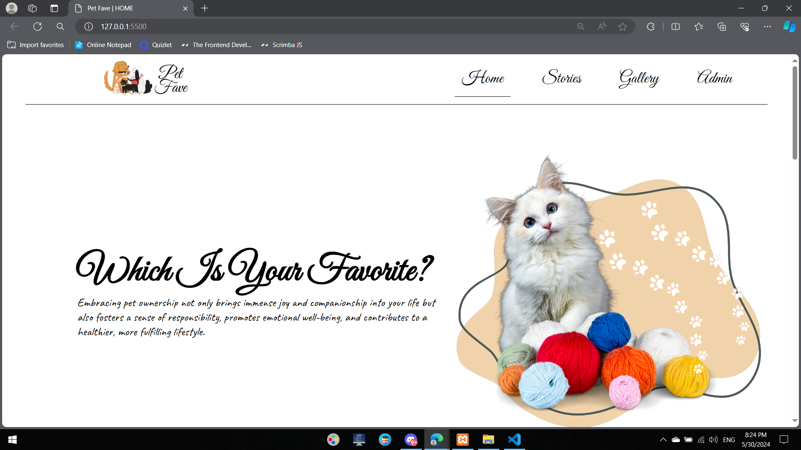
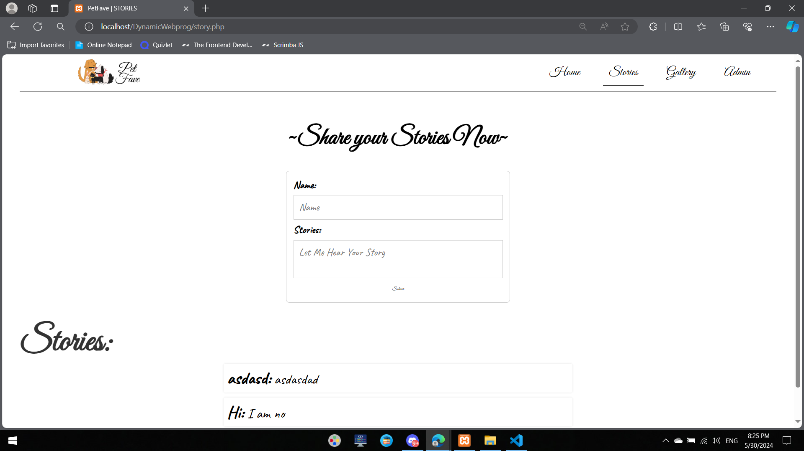
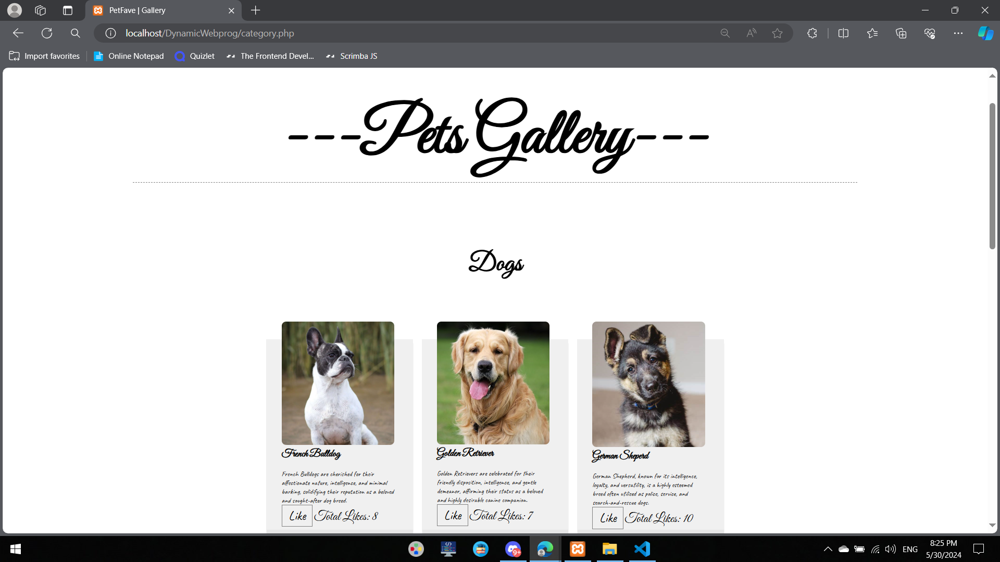
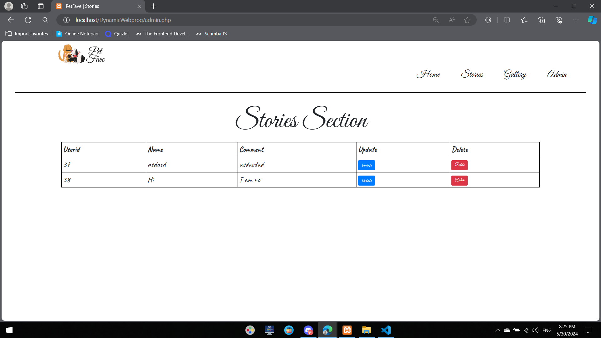

# 🐾 PetGallery – A Story-Driven Pet Gallery Website

**Full Stack CRUD Web Application**

PetGallery is a dynamic website that allows users to share heartwarming pet stories and interact with images by liking them. It features a complete admin dashboard for managing all submitted content via full CRUD (Create, Read, Update, Delete) operations.

---

## ✨ Features

### 👥 User-Side
- 📸 **View and Like Images** uploaded by the community
- 📝 **Post Pet Stories** via an interactive form

### 🛠️ Admin-Side
- 📚 **Full CRUD** control over all submitted pet stories
- 🧹 **Moderation Panel** for editing and deleting content

---

## 🧰 Tech Stack

- **Frontend**: HTML, CSS, JavaScript 
- **Backend**: PHP 
- **Database**: MySQL 

---

## 📸 Screenshots

<table>
  <tr>
    <td align="center">
       
      👋 Hero Page
    </td>
    <td align="center">
       
      📖 Pet Stories Page
    </td>
    <td align="center">
       
      🖼️ Gallery Page
    </td>
    <td align="center">
       
      🛠️ CRUD Dashboard
    </td>
  </tr>
</table>

---

📬 Reach Out for Access

Access may be granted upon request for educational or review purposes.

---
